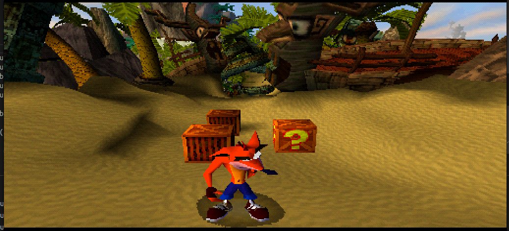

# PSX Emulator em C

Emulador do PlayStation 1 escrito em C11. O projeto segue uma abordagem de
baixo nivel: CPU, DMA, GPU, GTE, CD-ROM, SIO, timers e demais dispositivos sao
implementados no proprio codigo, usando SDL2/OpenGL apenas para janela,
entrada e apresentacao da VRAM.

## Dependências

- GCC (C11)
- SDL2
- OpenGL / GLEW

```bash
# Ubuntu/Debian
sudo apt install gcc libsdl2-dev libglew-dev
```

## Build e execução

```bash
make              # compila
make run          # compila e executa (usa bios/BIOS.ROM)
make smoke        # roda 500k instruções sem janela e sai (CI)
make test-cdrom   # roda testes unitários do controlador CD-ROM
make test-disc    # roda testes unitários de imagens .bin/.cue
make test-sio     # roda testes unitários de SIO/joypad
make test-gte     # roda testes unitários do GTE
make test-dma     # roda testes unitários de DMA
make debug        # compila com ASan/UBSan e executa
make clean        # remove artefatos
```

Opções do binário:

```text
./ps1_boot [--bios <path>] [--exe <path>] [--disc <path>] [--headless] [--max-instructions <N>]
```

A BIOS não está incluída no repositório. Coloque o arquivo em `bios/BIOS.ROM`
ou passe o caminho via `--bios`.

Exemplos úteis:

```bash
# Executar um jogo em .bin raw 2352 bytes/setor
./ps1_boot --bios bios/BIOS.ROM --disc "games/Crash Bandicoot (USA)/Crash Bandicoot (USA).bin"

# Rodar um PS-X EXE diretamente
make run-exe EXE=tests/psxtest_cpu/psxtest_cpu.exe

# Rodar EXE sem janela por um número fixo de instruções
make run-exe-headless EXE=tests/psxtest_gpu/psxtest_gpu.exe MAX_INSTRUCTIONS=5000000
```

## Logging

Ative logs por subsistema com a variável `PS1_LOG`:

```bash
PS1_LOG=IRQ,DMA,GPU make run
```

Subsistemas: `CPU`, `DMA`, `GPU`, `IRQ`, `CDROM`, `SPU`, `SIO`.

## Entrada

O SIO implementa pad digital do PS1. A entrada funciona por teclado SDL e por
controle generico quando exposto pelo SDL GameController.

Tambem existe um modo de teste por ambiente para manter botoes pressionados:

```bash
PS1_PAD_HELD=START,CROSS ./ps1_boot --bios bios/BIOS.ROM --disc "games/Crash Bandicoot (USA)/Crash Bandicoot (USA).bin"
```

## Estado atual

| Subsistema | Status |
| ---------- | ------ |
| CPU MIPS R3000A | funcional para BIOS, EXE e jogos iniciais |
| Interconnect / mapa de memória | funcional |
| RAM 2 MB / BIOS 512 KB | funcional |
| DMA (block + linked-list) | funcional |
| GPU GP0/GP1 | rasterizacao software, VRAM 1024x512, textura de apresentacao |
| GTE / COP2 | RTPS/RTPT, NCLIP, MVMVA, lighting/color e UNR funcionando para boot/jogo inicial |
| CD-ROM | imagem .bin raw, comandos principais, leitura por scheduler e DMA3 |
| SIO / Joypad digital | teclado, controle generico e modo `PS1_PAD_HELD` |
| MDEC | fluxo DMA/decodificacao parcial, ainda com diferencas de cor/imagem |
| SPU | ADPCM/vozes/DMA basico, clock por tempo emulado, mixer CD->SPU e CD-XA/CD-DA basicos |
| IRQ control (I_STAT/I_MASK) | implementado |
| Scheduler / VBlank | implementado |
| Timers (root counters) | implementado |

O emulador passa pelas logos iniciais e chega ao jogo em Crash Bandicoot. A
geometria principal da cena foi corrigida com ajustes de GTE/RTPS/UNR/MAC, mas
ainda existem artefatos visuais restantes, principalmente pontos verdes/ruido
e diferencas em transparencia/texturas.

## Testes

Testes unitários locais:

```bash
make test-cdrom
make test-disc
make test-sio
make test-gte
make test-dma
make test-spu
make smoke
```

Testes baseados em PS-X EXE/ROMs em `tests/`:

```bash
make test-psx-list
make test-psx-cpu
make test-psx-dma
make test-psx-gpu
make test-psx-gte
make test-psx-input
make test-psx-mdec
make test-psx-spu
make test-psx-timers
make test-psx-all PSX_TEST_ARGS="--timeout 60 --max-instructions 80000000"
```

O runner gera saidas em `tests/out/`. Para investigar diferencas de GPU, veja
`run.log`, `vram.png`, `vram.ppm` e `diffvram.log` dentro do teste especifico.

## Proximos alvos

- Corrigir os artefatos visuais restantes no jogo, começando por
  `gpu/transparency`, `gpu/uv-interpolation`, `gpu/triangle` e `gpu/clut-cache`.
- Melhorar precisao de textura, semi-transparencia e regras de borda da GPU.
- Continuar MDEC colorido, especialmente YUV -> RGB, rounding e empacotamento
  15/24-bit.
- Refinar audio: resampling XA mais fiel, suporte CUE/multitrack para CD-DA
  real, ADSR/reverb mais precisos e testes auditivos.

## Referências

- [psx-spx](http://problemkaputt.de/psx-spx.htm) — especificação completa do hardware
- [psx-guide](https://github.com/simias/psx-guide) — guia de implementação
- [rustation](https://github.com/simias/rustation) — emulador Rust de referência
- [DuckStation](https://github.com/stenzek/duckstation) — referência moderna para comparar detalhes de GPU/GTE

## Jogo 


